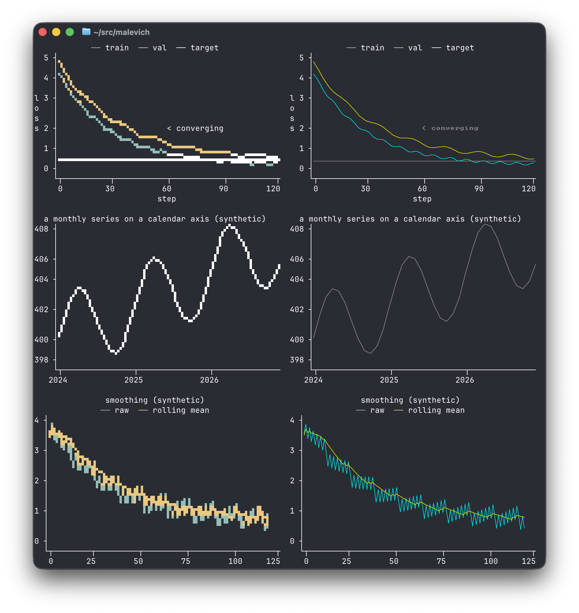
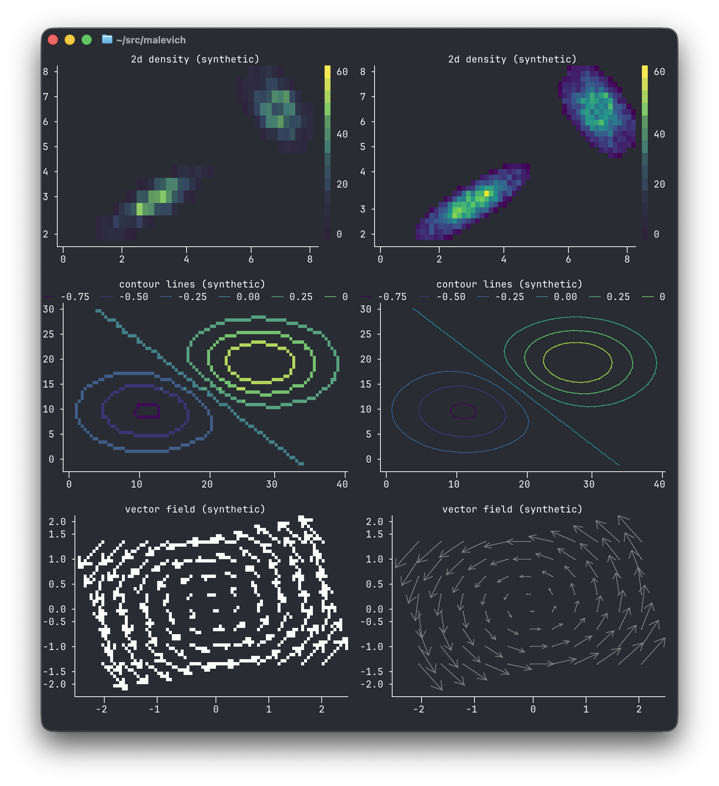

# malevich

**Terminal plotting for Rust: a small grammar of marks, honest axes, millions of
points.**

Eight marks. A real statistics layer. Ten million points in 28 milliseconds. Axes
placed by the same algorithm the visualization literature settled on — with labels
that are exact decimals, never `0.30000000000000004`. All of it in plain values that
render to a `String`, degrade gracefully on any terminal, and never touch global
state.

```rust
println!("{}", malevich::line(&[1.0, 5.0, 2.0, 8.0][..]));
```

<!-- generated:readme_sample -->
```text
8 ┤                         ⡠⠊
  │                       ⡠⠊
  │       ⣀⠤⠒⠤⣀        ⢀⠔⠉
4 ┤    ⡠⠔⠊     ⠉⠒⠤⣀  ⢀⠔⠁
  │⢀⡠⠔⠉            ⠉⠒⠁
0 ┤⠁
  └┬────────┬───────┬────────┬
   0        1       2        3
```
<!-- /generated -->

```rust
println!("{}", malevich::bar(["mon", "tue", "wed", "thu", "fri"], &[3.0, 7.0, 4.5, 8.0, 6.0][..]));
```

<!-- generated:readme_bars -->
```text
8 ┤         ▁▁▁▁▁         █████
  │         █████         █████  ▃▃▃▃▃
  │         █████         █████  █████
4 ┤         █████  █████  █████  █████
  │  ▆▆▆▆▆  █████  █████  █████  █████
  │  █████  █████  █████  █████  █████
0 ┤  █████  █████  █████  █████  █████
  └─────────────────────────────────────
      mon    tue    wed    thu    fri
```
<!-- /generated -->

And the charts no other terminal library ships — box plots, violins, densities, 2D
histograms:

<!-- generated:boxes -->
```text
                 flipper length by species
  230 ┤                                        ⠉⠉⢹⠉⠉
      │                                          ⢸
  220 ┤                                       ⣿⣿⣿⣿⣿⣿⣿⡇
      │                                       ━━━━━━━━
  210 ┤        ⣀⣀⣄⣀⣀           ⠉⠉⢹⠉⠉          ⠉⠉⠉⢹⠉⠉⠉⠁
m     │          ⡇               ⢸             ⣀⣀⣸⣀⣀
m 200 ┤          ⡇           ⢰⣶⣶⣶⣾⣶⣶⣶⡆
      │      ⢠⣤⣤⣤⣧⣤⣤⣤        ⢸━━━━━━━━
  190 ┤      ⢸⣿⣿⣿⣿⣿⣿⣿        ⠘⠛⠛⠛⢻⠛⠛⠛⠃
      │      ━━━━━━━━━           ⢸
  180 ┤          ⡇               ⢸
      │          ⡇             ⠉⠉⠉⠉⠉
  170 ┤        ⠉⠉⠋⠉⠉
      └─────────────────────────────────────────────────────
              Adelie         Chinstrap        Gentoo
```
<!-- /generated -->

And the classic asciichart look, one glyph per column, whenever you want charts
this quiet — with real axes underneath, which the original never had:

```rust
Plot::new().layer(Line::y(&values[..]).style(LineStyle::Corners))
```

<!-- generated:corners -->
```text
                          the corners style
 15 ┤              ╭───────────╮
    │            ╭─╯           ╰─╮
 10 ┤          ╭─╯               ╰──╮
    │        ╭─╯                    ╰╮
  5 ┤      ╭─╯                       ╰─╮
    │     ╭╯                           ╰─╮
  0 ┤     ╯                              ╰╮
    │                                     ╰─╮
 -5 ┤                                       ╰─╮
    │                                         ╰╮                   ╭──
-10 ┤                                          ╰──╮              ╭─╯
    │                                             ╰─╮         ╭──╯
-15 ┤                                               ╰─────────╯
    └┬──────────┬─────────┬──────────┬──────────┬──────────┬─────────┬
     0         10        20         30         40         50        60
```
<!-- /generated -->

Every chart in these docs is real program output, spliced in by
`cargo run --example regen_docs` and verified in CI — never typed by hand. More in the
gallery: [EXAMPLES.md](EXAMPLES.md), and `cargo run --example showcase` renders a
colored tour sized to your terminal.

In a terminal it looks like this — `cargo run --example showcase --features pixel`
renders every chart twice, cells on the left and real pixels (sixel / kitty /
iTerm2) on the right, from the same plot values:





## Why malevich

- **A small grammar, not a chart zoo.** Eight marks (line, points, bars, area, cells,
  range, rule, text) × a stats layer × shared scales compose into the whole basic
  chart catalog. Every preset — `line`, `scatter`, `bar`, `hist`, `stairs`, `ecdf`,
  `heatmap`, `hist2d`, `density`, `box_plot`, `violin`, `error_bars` — is proven
  bit-identical to its grammar expansion in tests.
- **The statistical set no terminal library has.** Box plots with type-7 quartiles
  and Tukey whiskers, violins from a real KDE (Silverman bandwidth), ECDFs, error
  bars, 2D densities (with a colorbar legending the value scale) — the charts
  science and ML actually need.
- **Millions of points, measured.** Large line layers are aggregated by M4 —
  min/max/first/last per raster column, bucketed by the column each point renders
  into, so the reduction is *pixel-identical* to drawing every point. Ten million
  points render end to end in ~45 ms single-threaded; a million
  KDE samples take 23 ms (`cargo bench --bench render`). Every aggregator is a
  mergeable monoid, so host-side parallelism and streaming are compositions, not
  features.
- **Axes that are actually good.** Extended-Wilkinson tick placement (Talbot, Lin,
  Hanrahan 2010), exact-decimal labels that parse back to their values, one shared SI
  prefix per axis (`2.5M`, `100µ`), log axes with superscript decades, calendar time
  axes with multi-scale labels (`14:05`, `Aug 2`, `2027`), typed axis specs
  (`Scale::{Auto, Linear, Log, Time, Bands}`), axis titles, band scales with fitted
  category labels, collision-aware layout that sheds furniture instead of failing.
- **Renders everywhere, honestly.** Six charsets — Unicode 16 octants (braille
  density, solid ink — auto-selected on terminals known to render them), braille,
  sextants, quadrants, half-blocks, ASCII — and four color tiers (truecolor → 256 →
  16 → plain) with honest downhill quantization; piped output is automatically clean
  plain text; CJK labels stay aligned; `NaN` is always a visible gap, never
  interpolated away.
- **Real pixels where the terminal speaks them (feature `pixel`).** The ladder's
  top rung: `plot.render_pixels(&frame, &graphics)` keeps title, axes, and legend
  as crisp text cells and draws the plot rectangle as an actual image — sixel,
  kitty graphics, or iTerm2 inline PNG, all hand-rolled, no new dependencies.
  Marks rasterize at device-pixel resolution through the same pipeline (M4 buckets
  per pixel column; heatmaps sample per pixel), undrawn panel stays transparent to
  your terminal background, and the result is still a deterministic `String`.
  `Capabilities::detect()` asks the terminal itself what it speaks — one probed
  round trip (cached per process) that, unlike environment sniffing, survives
  ssh — and `plot.render_best(&frame)` is the one-call ladder top: pixels when
  capable, cells everywhere else. Every gallery example upgrades with
  `--features pixel`, and `cargo run --example showcase --features pixel` renders
  each chart side by side, cells against pixels.
- **Small multiples and fixed axes.** `Grid` pastes plots side by side
  (escape-aware alignment); `x_domain`/`y_domain` fix axes matplotlib-style — so
  shared scales across a dashboard are an explicit composition, not a mode.
- **A ratatui widget, if you want one.** With the `ratatui` feature (depending only
  on `ratatui-core`), `plot.widget()` drops any chart into a TUI — cells written
  straight into the buffer, colors as styles, your app keeps the terminal
  (`cargo run --example tui --features ratatui`). For full apps, [`demos/`](demos/)
  has `fred` — a five-view Federal Reserve data browser (`cargo run -p fred`) — and
  `sysmon` — a live system monitor streaming CPU/memory/network through
  `stream::Ring` into a per-core heatmap (`cargo run -p sysmon`).
- **Serializable specs, no lies.** With the `serde` feature, every plot round-trips
  through serde — send one over the wire, cache it, snapshot it as JSON. Gaps encode
  as `null` and decode back to gaps; a function-backed line refuses to serialize
  rather than silently drop its curve.
- **Plots from ndarray.** With the `ndarray` feature, one-dimensional arrays and
  views plot directly — contiguous storage zero-copy, a strided matrix column
  converted once, like any other input.
- **Plots from polars, with no dependency.** polars is too big to depend on, but it
  needs no special support: a contiguous column borrows zero-copy, and its
  null-yielding iterator maps straight onto the gap convention.

  ```rust
  // Contiguous and null-free: borrowed, no copy.
  let chart = malevich::line(df.column("loss")?.f64()?.cont_slice()?);

  // Anything else: nulls become gaps (NaN), converted once at ingestion.
  let series = df.column("loss")?.f64()?.iter().map(|v| v.unwrap_or(f64::NAN));
  let chart = malevich::line(series.collect::<Vec<_>>());
  ```
- **Live charts without a framework.** A thread-shared sliding window plus an
  in-place repaint handle (cursor up, erase down, one write): flicker-free streaming
  that survives in scrollback and never takes over your terminal
  (`cargo run --example live`).
- **Plots are plain values.** `Clone + Send + Sync`, no globals, rendering is a pure
  function of plot and frame — build on one thread, render on another, snapshot-test
  the strings. Two tiny dependencies (`terminal_size`, `unicode-width`).

**Stability**: the crate is 1.x — the public API follows semver (breaking changes
mean a 2.0), guarded in CI by `cargo-semver-checks` against the last published
release. The concept vocabulary is documented in [TERMINOLOGY.md](TERMINOLOGY.md)
and changes are in the [CHANGELOG](CHANGELOG.md).

## Command line

The same renderer, from any shell. [`kaz`](cli/) (crate
[`malevich-cli`](cli/README.md)) is a stdin-first plotter — one subcommand per
chart, plot on stderr, data passthrough on stdout so it can sit mid-pipeline:

```sh
cargo install malevich-cli               # installs the `kaz` binary
cat loss.tsv | kaz line -t training
awk '{print $5}' access.log | kaz hist
cut -f2 species.tsv | kaz count
cat data.tsv | kaz line -O | next-tool   # plot on stderr, data flows on
```

It contains zero rendering logic — argument parsing, stdin framing, and calls
into this crate's public API — which makes it the proof that a pure
string-renderer is enough. Details in [cli/README.md](cli/README.md).

## What it will not be

Not a TUI framework (it never owns the terminal or handles input). No animations. No
file parsing or dataframes in core — ingestion traits only. No config-object kitchen
sink: if an option is not a mark channel, stat parameter, scale option, or theme
entry, it does not ship.

## Name

Kazimir Malevich painted a black square on a plain ground and meant it: a small
vocabulary of geometric forms, composed deliberately. That is the design budget of
this library.

## Acknowledgements

malevich stands on the shoulders of giants — the algorithms, libraries, and grammars
that taught this project what it knows are credited, specifically, in
[ACKNOWLEDGEMENTS.md](ACKNOWLEDGEMENTS.md).

## License

MIT or Apache-2.0.
